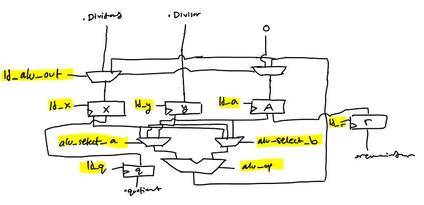
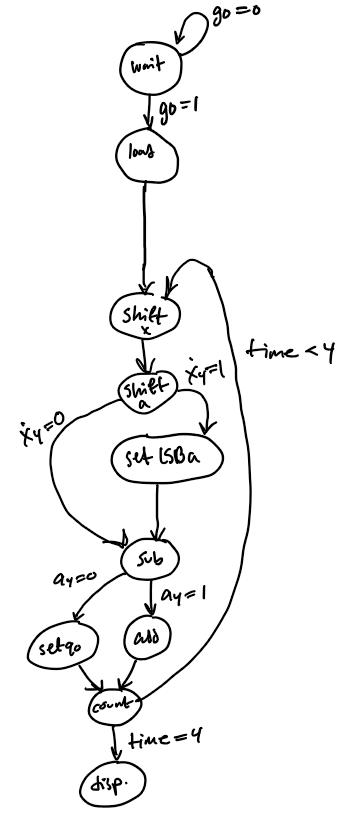

# 4-Bit Restoring Divisor

A 4-bit restoring divisor designed in Verilog for my Digital and Computer Systems course.
It features a data path with registers and an arithmetic unit as well as a control path with a finite state machine and timer.

